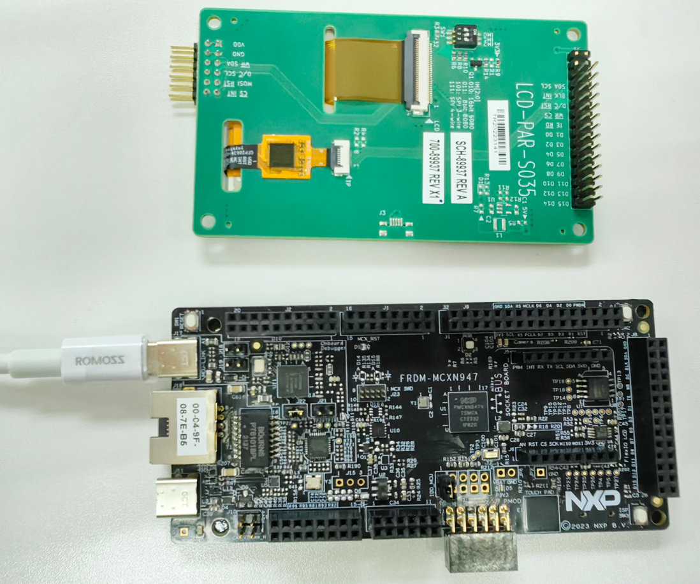
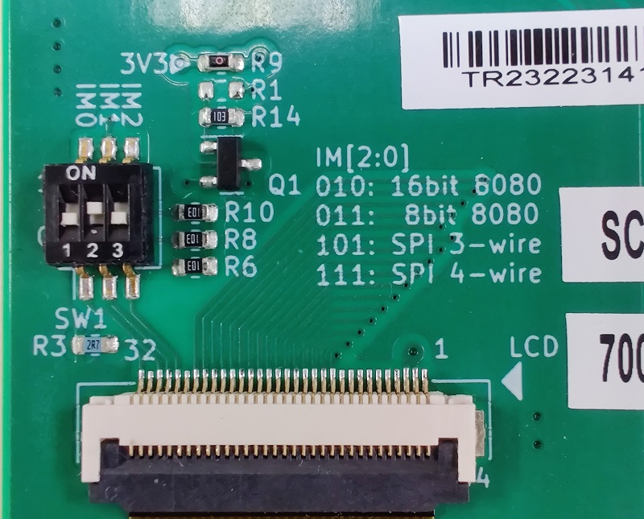
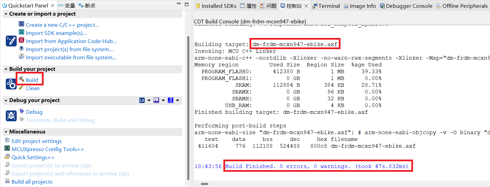
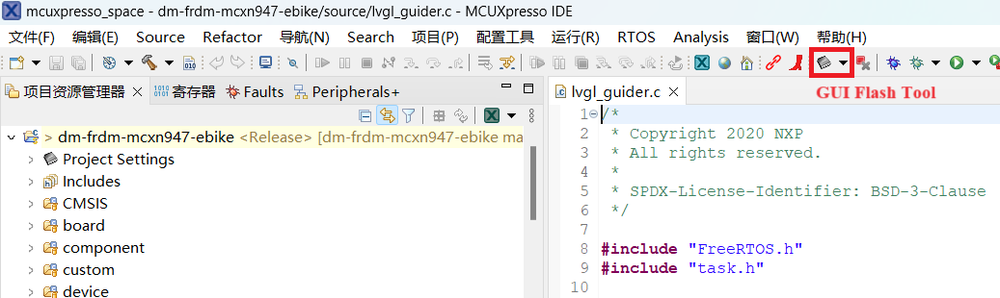
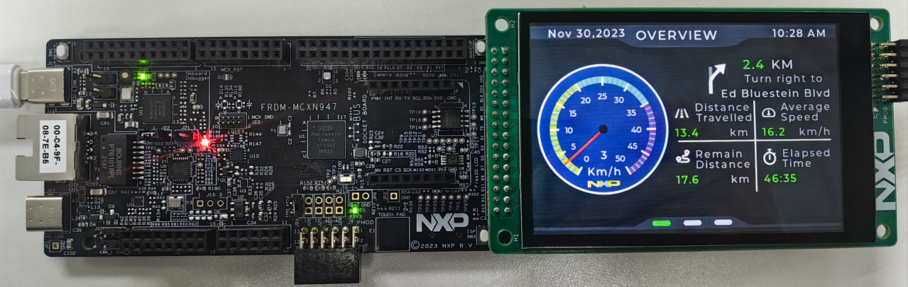
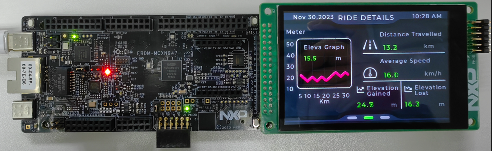
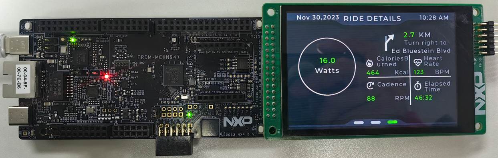

# NXP Application Code Hub

## How to develop an electric bicycle dashboard design on MCXN947

This demo is an example of dashboard for electric bicycle. This demo is based on LVGL 8.3.10 and GUI Guider 1.6.0-GA. This demo can be used by customers to evaluate GUI performance of MCXN947. Here, this demo uses MCXN947 as target MCU and uses internal flash to store image source and font source. This demo supports various GUI widgets to show customer information such as meter panel, chart, label.

#### Boards: FRDM-MCXN947

#### Categories: HMI

#### Peripherals: DISPLAY

#### Toolchains: MCUXpresso IDE

## Table of Contents

1. [Software](#step1)
2. [Hardware](#step2)
3. [Setup](#step3)
4. [Results](#step4)
5. [FAQs](#step5) 
6. [Support](#step6)
7. [Release Notes](#step7)

## 1. Software

The software for this demo is delivered in raw source files and MCUXpresso IDE projects. Software version:

1. Download [SDK_2_14_0_FRDM-MCXN947](https://mcuxpresso.nxp.com/en/welcome).

2. Download and install [MCUXpresso IDE V11.9.0 or later](https://www.nxp.com/design/design-center/software/development-software/mcuxpresso-software-and-tools-/mcuxpresso-integrated-development-environment-ide:MCUXpresso-IDE).

3. MCUXpresso IDE V11.9.0 for Visual Studio Code: This example supports MCUXpresso IDE V11.9.0 for Visual Studio Code, for more information about how to use Visual Studio Code please refer [here](https://www.nxp.com/design/training/getting-started-with-mcuxpresso-for-visual-studio-code:TIP-GETTING-STARTED-WITH-MCUXPRESSO-FOR-VS-CODE).

## 2. Hardware

The hardware environment for this demo are listed here:

1. **FRDM-MCXN947** 

2. **LCD-PAR-S035**

3. **Type-C** USB cable

4. **Personal Computer**

## 3. Setup

### 3.1 Step 1(Hardware configuration)

1. Prepare FRDM-MCXN947, Type-C USB cable and LCD-PAR-S035.  
   </img>

2. Plug LCD-PAR-S035 into J8 like this.  
   </img>

3. Configure the LCD module interface to 16-bit 8080 by setting the mode switch (SW1) to **0-1-0**.  
   </img>

4. Connect J17(MCU-LINK) on FRDM-MCXN947 and PC with Type-C USB cable.  
   </img>

### 3.2 Step 2(Software configuration)

1. Open MCUXpresso IDE, in the Quick Start Panel, choose **Import from Application Code Hub**.  
   </img>

2. Enter the demo name in the search bar.  
   </img>

3. Click **Copy GitHub link**, MCUXpresso IDE will automatically retrieve project attributes, then click **Next>**.  
   </img>

4. Select **main** branch and then click **Next>**, Select the MCUXpresso project, click **Finish** button to complete import.  
   </img>

5. Click **Build** to start compiling the project.  
   </img>

6. To download program into MCU, please press **GUI Flash Tool** icon in MCUXpresso IDE.  
   </img>

### 3.3 Step 3(Run)

   Press **SW1** button on **FRDM-MCXN947** board to run this demo.

## 4. Results

When this demo board is powered-up and then press reset **SW1** button, the demo will show the home screen. Then **switch the screens towards forward or backward by sliding right or left on the display**.  
  </img>  
  </img>  
  </img>

## 5. FAQs

No FAQs have been identified for this project.

## 6. Support

#### Project Metadata

<!----- Boards ----->

<!----- Categories ----->

<!----- Peripherals ----->

<!----- Toolchains ----->

Questions regarding the content/correctness of this example can be entered as Issues within this GitHub repository.

> **Warning**: For more general technical questions regarding NXP Microcontrollers and the difference in expected funcionality, enter your questions on the [NXP Community Forum](https://community.nxp.com/)

## 7. Release Notes

| Version | Description / Update                    | Date                         |
|:-------:| --------------------------------------- | ----------------------------:|
| 1.0     | Initial release on Application Code Hub | January 30th 2024 |
